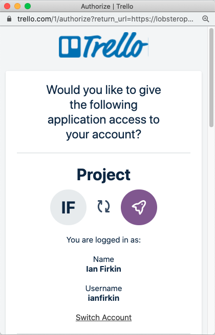
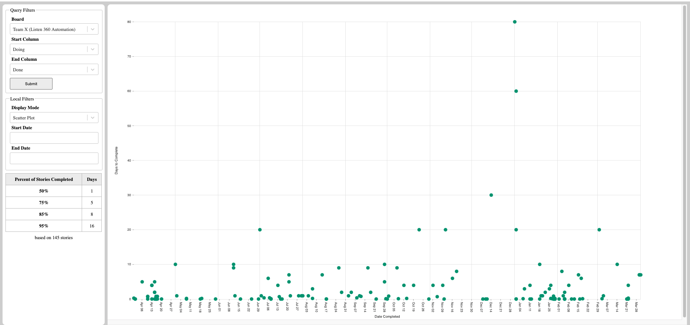
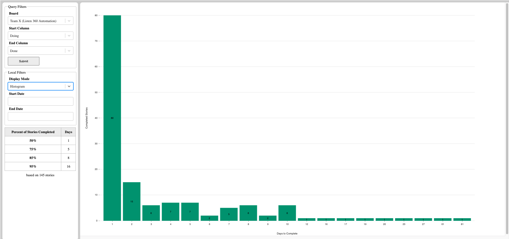

# Trello Stats Visualizer

This is a simple data visualization application, to allow teams to view throughput metrics based on cards on a trello board.  It can  display a scatter plot and percentiles for cycle time, as well as grouping the data into a histogram. 

## Using the Application

You can view your own trello stats in the application hosted on [github](https://lobsteropteryx.github.io/trello-stats/).  When you open the app, you should see an authentication popup, something like this:

Scroll to the bottom of the pop-up window, and authorize the application to read data from your trello account.  Once you authorize the app, you should see the list of available boards be populated.  **If you're having trouble authenticating, check your popup blockers, and be sure that the auth popup isn't hidden behind another window.**

After authenticating, select the board you want to visualize, and the start and end columns from that board.  The columns will determine how the cycle time is calculated, and should correspond to when the work starts, and when it is complete.  Once you've selected your board and columns, click the submit button to see the data.

### Percentiles

In addition to the charts, the percentiles for the data are always visible in the lefthand panel.  This provides a convenient way to talk about forecasting--"We complete 50% of our stories within a day, and 95% within a week."

### Scatter Plot

By default, the application will show a scatter plot of the data:

The scatter plot allows you to visualize patterns and outliers in your data, and help track down factors that contribute to them.  By hovering over any point in the scatter plot, you can see exactly which story the data point refers to.  Clicking on the point itself will open up the story in trello.

### Histogram

If you want to see the distribution of cycle times across all your stories, you can select historgram mode:

### Date Filtering

By default, the application will display all of the data, going back to whenever the board was created.  If you want to slice the data by time, you can select start and end dates, and dynamically filter the charts and percentile data.

## Assumptions and Acknowledgements

This tool grew out of a certain way of working that evolved over years, with a specific group of people.  While all teams and organizations are unique, there are some principles that have informed the design of this tool.  If your team follows similar principals, it may be useful for you as well!  The principles include:

* Teams work together, with an emphasis on collaboration.  Teams strive for to limit work in process (WIP) to a single story at a time.
* We optimize for flow of work over utilization of people.
* We slice stories as small as possible, and use statistical methods for forecasting, rather than detailed estimation at the story level.

Finally, this inspiration and knowledge for this application have come from many people and places, but the techniques and approaches in the app are outlined clearly in [Daniel S. Vacanti's](https://actionableagile.com/about-us) great book, [*Actionable Agile Metrics for Predictability*](https://actionableagile.com/publications).  This application is a good fit for our specific needs, and was a great learning opportunity to practice some of the ideas in the book.  If you are looking for a more complete treatment, Actionable Agile has their own [software suite](https://actionableagile.com/#overview).